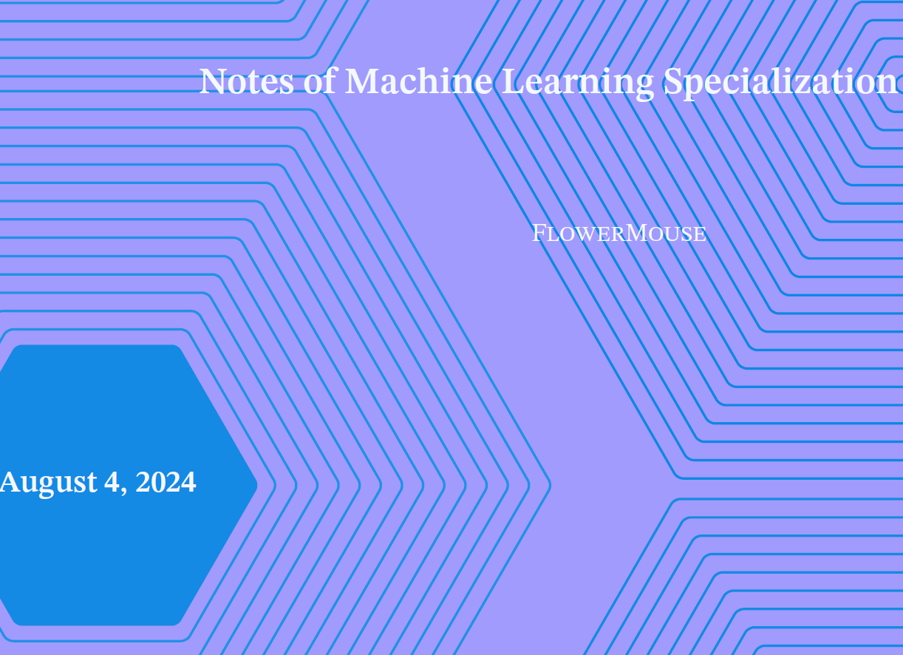
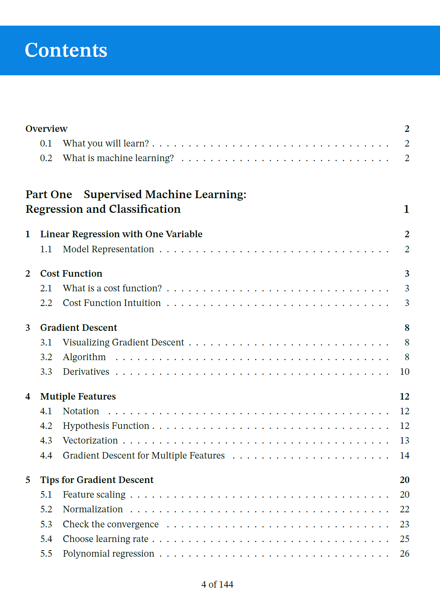
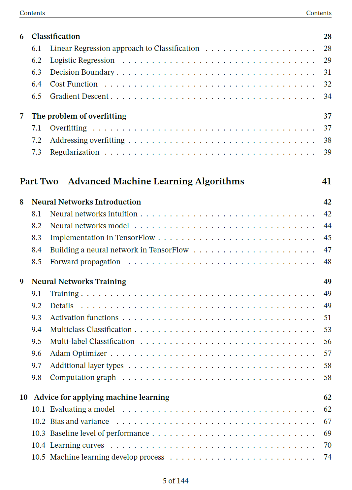
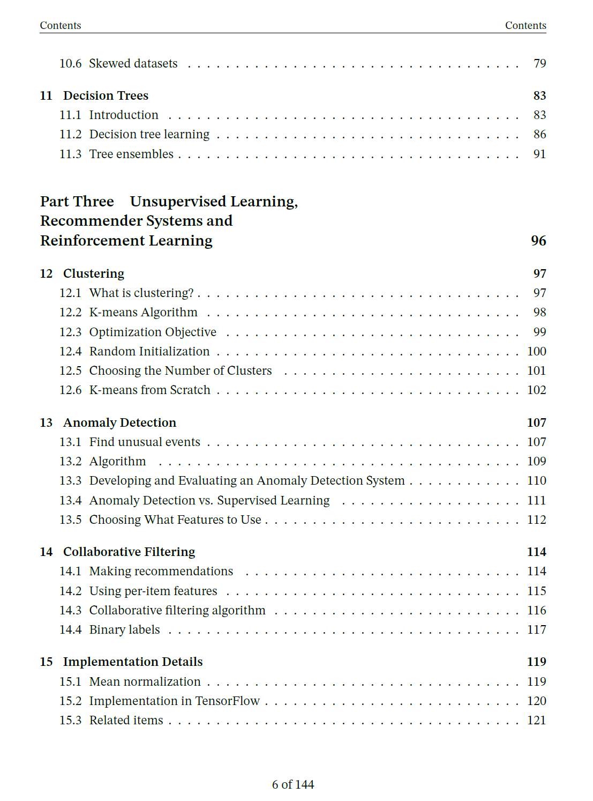
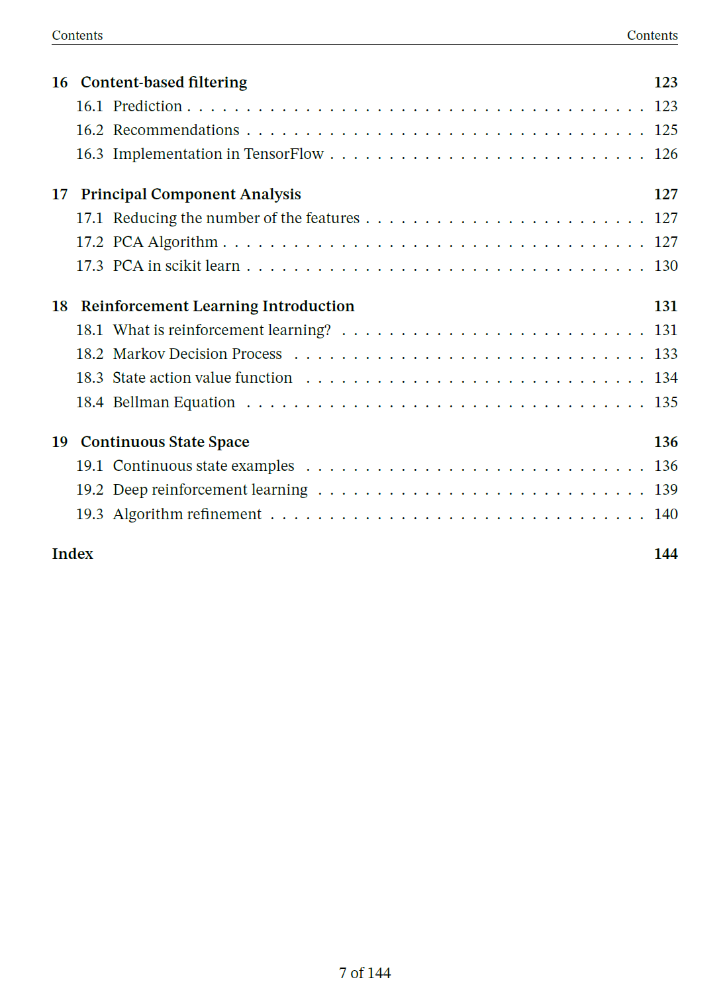

# My Notes For "Machine Learning Specialization" by Andrew Ng 

## Language 

- [English](#english) 
- [中文](#中文)
---
### English

[course website](https://www.coursera.org/specializations/machine-learning-introduction)

This note is based on the "Machine Learning Specialization" course. This course, taught by Andrew Ng, is an introductory course organized by Stanford University and deeplearning.ai. It is designed for a general audience and is less mathematically intensive compared to CS229, also taught by Andrew Ng. Basic knowledge of calculus and linear algebra is sufficient for this course. It is highly suitable for beginners in machine learning, but for those looking to deepen their understanding, further study in other areas is recommended.

These notes are written based on personal understanding and are not merely a recap of the course content. The organization is concise, aimed at summarizing and clarifying the course content with personal interpretations. They cannot substitute for course study; it is advisable to review them after completing the course. Initially, these notes were created for personal revision, but I also hope they can assist beginners in machine learning.

The pdf file is written by latex, and the latex template is provided by [amznotes](https://github.com/alexmingzhang/amznotes) 

Given my limited expertise, if you find any errors or inaccuracies, please feel free to raise them as issues.

---
### 中文

[课程网站](https://www.coursera.org/specializations/machine-learning-introduction)

本笔记基于"Machine Learning Specialization"。该课程是由斯坦福大学和deeplearning.ai组织的由Andew Ng 主讲的机器学习入门课程。由于是面向大众，该课程相较于同样是Andew Ng主讲的CS229难度降低了很多，数学推导较少，对于学习本课程中，只需要基础的微积分和线性代数即可。非常适合入门机器学习，但对于精进还需要深入学习其它内容。

本笔记内容基于个人理解而编写，并不完全是课程内容的复述，内容组织也比较简洁，是对课程内容的梳理与总结，并且加上了一些个人的解释，并不能替代课程学习，建议学习课程后再进行阅读复习。最初，本笔记的目的是便于个人复习。但是我也希望本笔记能帮助到机器学习的初学者。

本笔记由latex编写，latex模板由该项目[amznotes](https://github.com/alexmingzhang/amznotes)提供。

由于笔者水平有限，如有发现错误或不准确的地方，欢迎提出issue。
